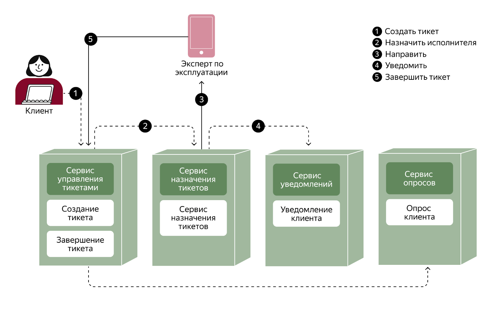
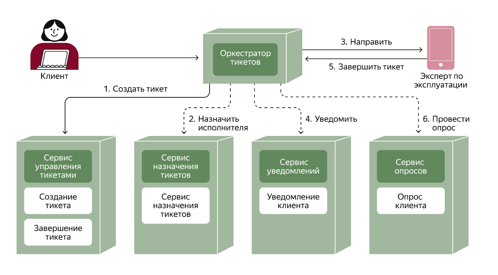

1. Родительский артефакт -
2. Автор ADR - JointFuse
3. Статус - В проработке
4. Согласующие - Solution Reviewer

## Контекст

Команда разрабатывающая платежную систему компании OrchestrPay решила использовать Saga-оркестрацию, требуется определить место размещения функции оркестрации - внутри одного из доменных сервисов или в отдельном сервисе-оркестраторе.
Текущая организационная структура OrchestrPay состоит из следующих команд:
- Отдел «Платёжные сервисы»: отвечает за разработку и развитие ключевых микросервисов платёжной платформы;
- Отдел «Финансы»: отвечает за финансовую отчётность и сверку операций;
- Команда «Customer Support»: обрабатывает обращения пользователей, связанные с платежами, сбоями и возвратами;
- Команда «Безопасность»: разрабатывает и внедряет antifraud-политики, проводит аудиты безопасности;
- Команда «DevOps/SRE»: отвечает за стабильность, мониторинг и логирование.

Характеристика платежной системы:
- Сложность бизнес-процесса. В рамках одной транзакции задействовано несколько сервисов выполняющих разные действия;
- Критически важно фиксировать текущее состояние процесса;
- Высокие требования к надежности внешних интеграций. Все вызовы должны выполняться с учётом тайм-аутов, retry-механизмов, идемпотентности и кеширования результатов;
- Мониторинг и трассировка. Платёжная система должна предоставлять бизнесу и службе безопасности прозрачный обзор хода транзакции.

Командой уже используется Camunda BPMN — исполнение бизнес-процессов и реализация Saga-оркестрации с поддержкой компенсационных транзакций.

## Рассмотренные варианты

### Вариант (/ Альтернатива) №1 Доменный оркестратор
Встроенная оркестрация внутри доменного сервиса, когда один из сервисов доменной области (часто владелец агрегата «Order») берёт на себя роль координатора, вызывая других участников и обрабатывая их ответы.

### Вариант (/ Альтернатива) №2 Внешний оркестратор
Отдельный сервис-оркестратор, выделенный микросервис предназначенный для управления шагами Saga, отслеживания состояния и рассылки команд.

## Сравнение альтернатив

|Вариант решения|Преимущества|Недостатки|
|:-:|:-|:-|
| Вариант №1 «Доменный оркестратор» | - Нет необходимости разрабатывать и поддерживать отдельный сервис - Нет необходимости выстраивать коммуникацию дополнительного сервиса с доменными| - Смешение доменной логики и процессов управления Saga - Сложнее вносить доработки, релиз связан с доменом - Сложнее обеспечить высокий уровень наблюдаемости всех этапов Saga |
| Вариант №2 «Внешний оркестратор» | - Простота развития доменных сервисов за счет изолированности от управления Saga - Удобнее версионировать систему и сценарии деплоя - В компании уже внедрен инструмент для реализации Saga - Больше возможностей для внедрения сбора метрик и других точек наблюдения | - Более высокие задержки - Дополнительный сервис который необходимо сопровождать и поддерживать |

## Принятое решение
Принято решение №2 «Внешний оркестратор». В бизнес процессе учавствуют больше трех сервисов, Saga содержит ветвления - для таких условий больше подходит выбранный вариант. Для бизнеса и нескольких комманд организации необходима развитая система логирования и наблюдения за процессом, а также возможность проведения аудита, в данном случае внешний оркестратор подходит лучше. Приложение развивается и некоторые команды активно внедряют новый функционал - для повышения качества релизов и снижения ошибок в проде необходимо использовать практики A/B тестирования, канареечных релизов и другие, это удобнее реализовывать с внешним оркестратором. При проведении платежа важна скорость на всех этапах обработки, но нет требования real-time выполнения операций, поэтому задержками межсервисной коммуникации которые возникают при добавлении внешнего оркестратора можно пренебречь. 